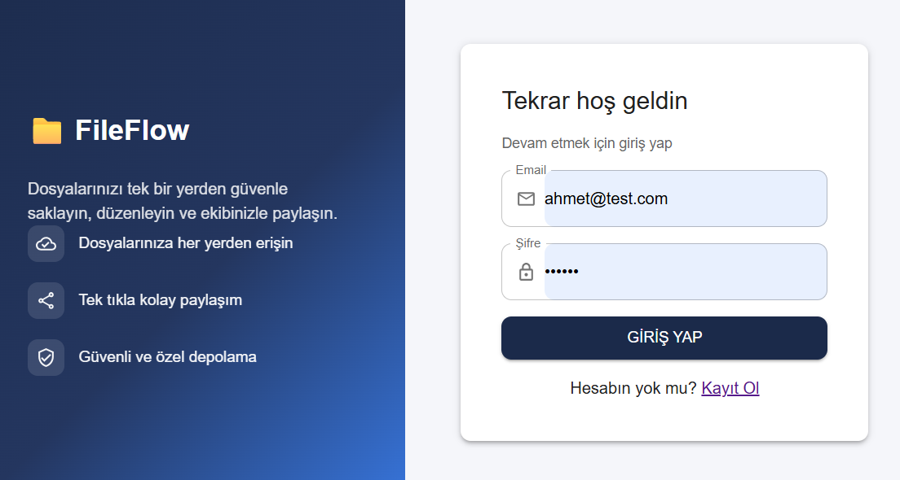
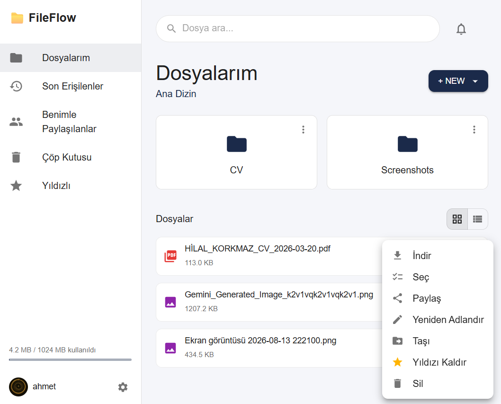
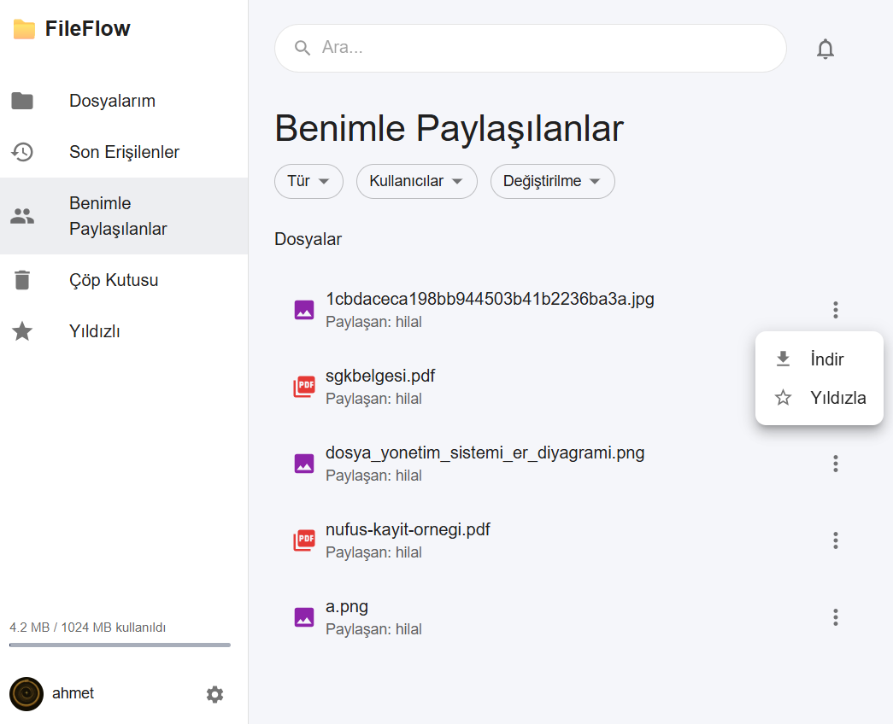
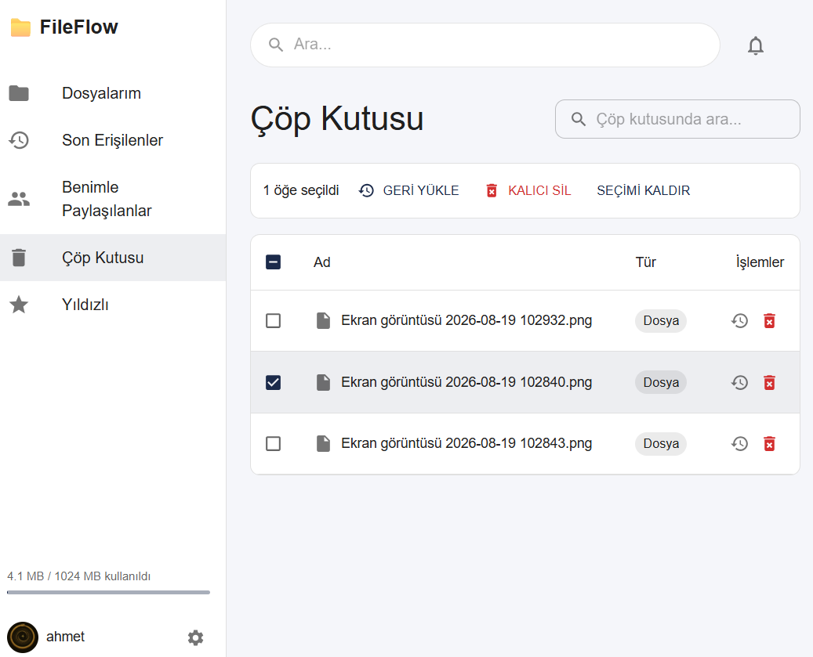
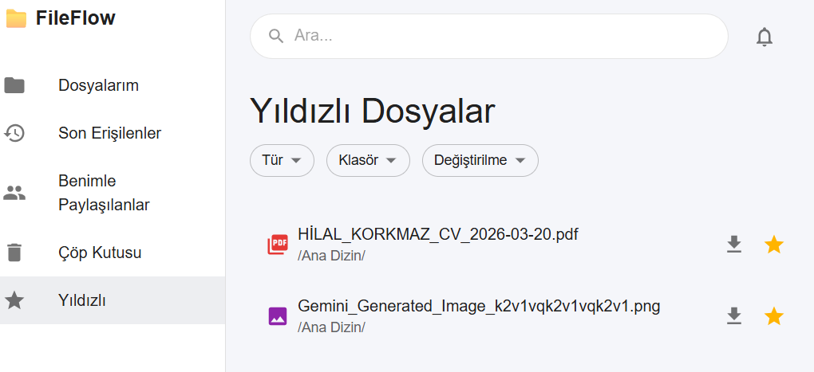
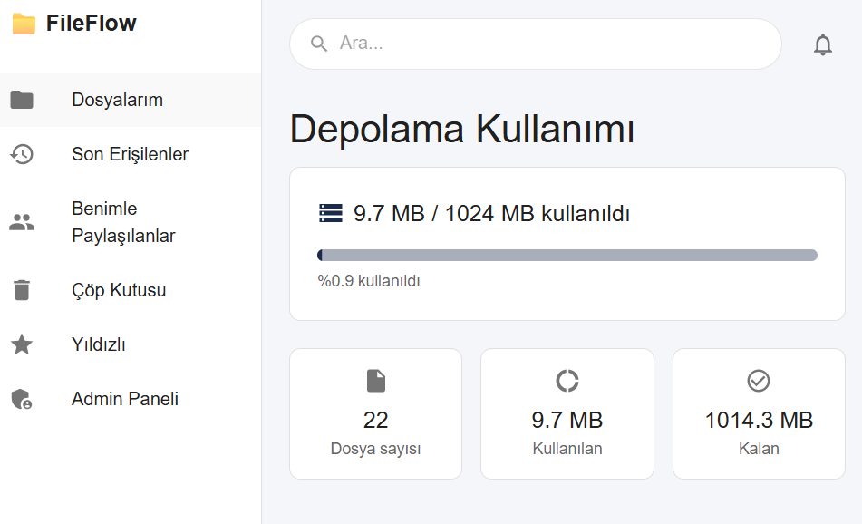
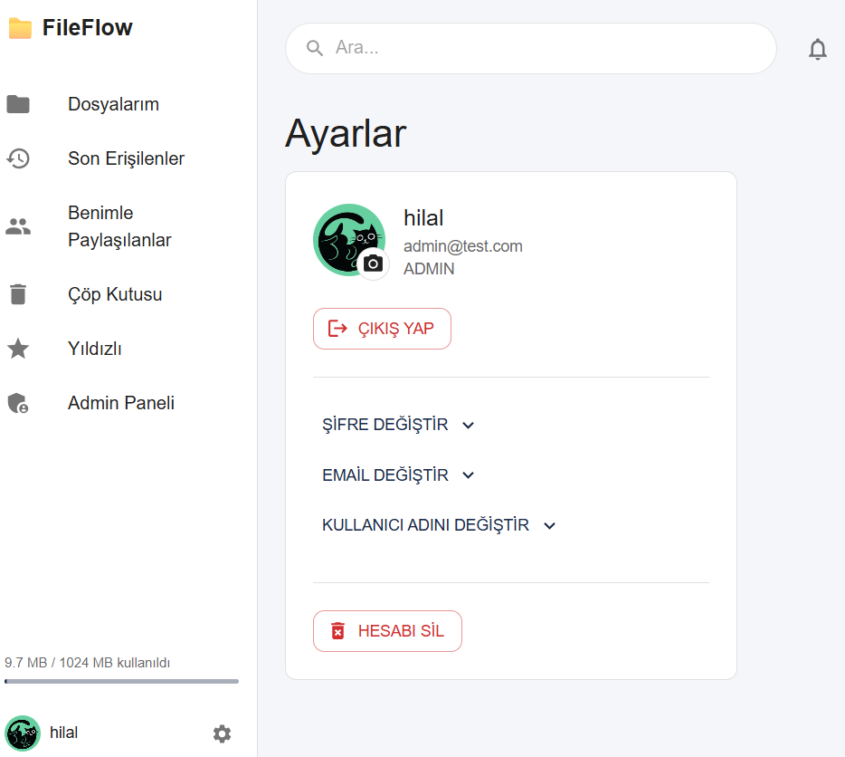
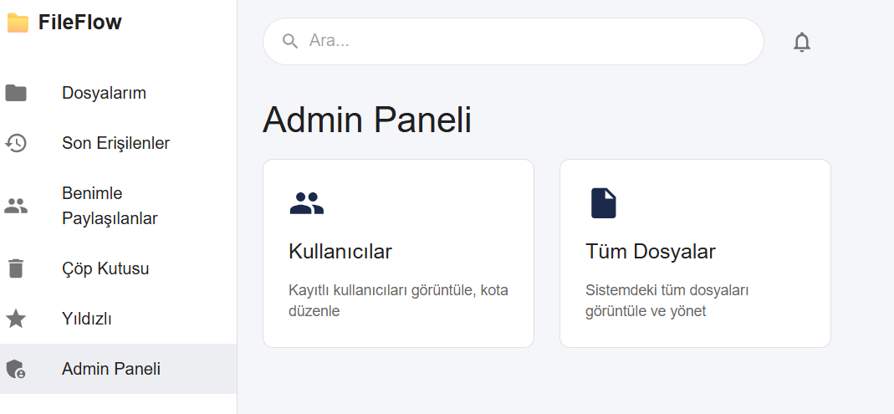
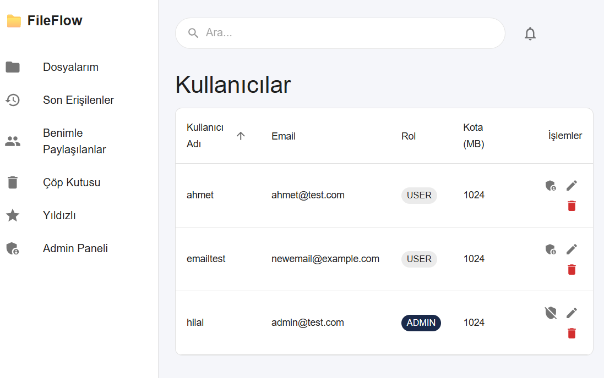
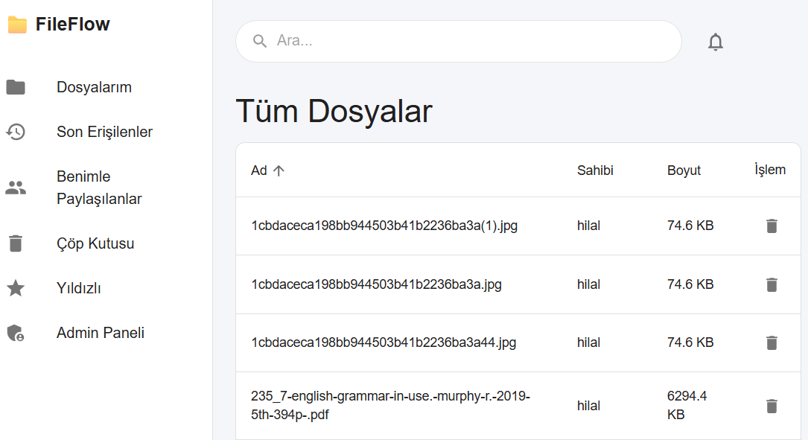

# 📁 FileFlow — File Management System

A web-based file management system built with Spring Boot and React, where users can upload, organize, and share their files and folders.

## Screenshots

| Login | My Files |
|---|---|
|  |  |

| Shared With Me | Trash |
|---|---|
|  |  |

| Starred | Storage Usage |
|---|---|
|  |  |

| Settings | Admin Panel |
|---|---|
|  |  |

| Admin — Users | Admin — All Files |
|---|---|
|  |  |

## Features

**File & folder management**
- Create folders, upload / download / delete / rename / move files
- Folder upload (preserving subfolder structure) and drag-and-drop upload (including nested folders)
- Grid / list view
- Bulk actions: multi-select files and folders to move or delete together

**Sharing**
- Share files/folders with a specific user
- Share via a time-limited (24-hour) download link
- Folder shares are read-only and are inherited by nested subfolders
- In-app notification when something is shared with you

**Search & organization**
- Search across your own files/folders and everything shared with you, from one search box
- Starring — per-user (starring a file someone shared with you doesn't affect their own copy)
- Recent — per-user access history
- Type, Folder/User, and Date filters on the Starred / Recent / Shared With Me pages

**Trash**
- Soft delete: removed files/folders land in the trash
- Restore or permanently delete, individually or in bulk

**Storage**
- Storage usage page: quota bar, file count, used/remaining space

**Account**
- JWT-based registration / login
- Profile photo, and changing password / email / username (a username change takes effect instantly, without interrupting the session)
- Permanently delete your account (along with all your files, folders, shares, and history)

**Admin panel**
- List all users, change role and storage quota, bulk or single delete
- Browse every file in the system
- Bulk actions on both the user and file tables

## Tech Stack

**Backend:** Java 17, Spring Boot 3, Spring Data JPA, Spring Security + JWT, PostgreSQL

**Frontend:** React 18, Vite, Material UI, React Router, Axios

## Project Structure

```
file-management-system/
├── backend/     # Spring Boot API
├── frontend/    # React application
└── docs/        # Screenshots, ER diagram, API documentation
```

## Getting Started

### Prerequisites
- Java 17+
- Node.js 18+
- Maven 3.9+
- PostgreSQL 16 (local install or Docker)

### 1. Database

```bash
docker run --name fms-postgres -e POSTGRES_PASSWORD=postgres -p 5432:5432 -d postgres:16
docker exec -it fms-postgres psql -U postgres -c "CREATE DATABASE file_management_db;"
```

### 2. Backend

```bash
cd backend
mvn spring-boot:run
```

The API starts on `http://localhost:8080`. Tables are created automatically by Hibernate.

### 3. Frontend

```bash
cd frontend
npm install
npm run dev
```

The app opens on `http://localhost:3000` and automatically proxies `/api` requests to the backend.

### Environment Variables (optional)

The defaults are fine for local development; the following **must** be overridden in production:

| Variable | Description | Default |
|---|---|---|
| `DB_URL` | PostgreSQL connection URL | `jdbc:postgresql://localhost:5432/file_management_db` |
| `DB_USERNAME` | Database username | `postgres` |
| `DB_PASSWORD` | Database password | `postgres` |
| `JWT_SECRET` | JWT signing key (32+ characters) | ⚠️ must be changed in production |

## User Roles

| Role | Permissions |
|---|---|
| Admin | User management (role/quota/delete), browse every file in the system |
| User | Create folders, upload/download/delete/move/share files, search, star |
